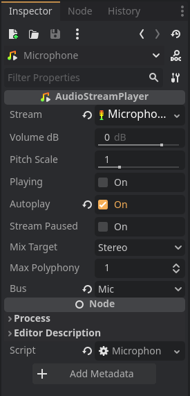
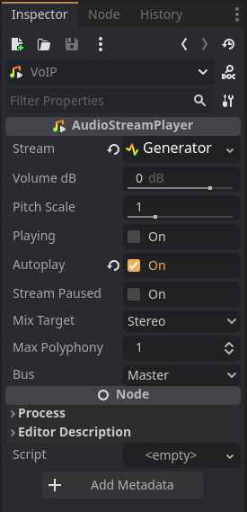

# GodotVoIP

A minimal VoIP example using no external libraries.

## Networking

The networking for this project follows the standard godot networking example found [here](https://docs.godotengine.org/en/stable/tutorials/networking/high_level_multiplayer.html#example-lobby-implementation).

## Audio Bus

In the audio tab I added two Buses, Mic and MicSink. The Mic Bus has a Capture effect on it and is pointing into MicSink which is muted. 

## Node Setup

The only required nodes are AudioStreamPlayers and/or their 2D and 3D counterparts.

### Microphone Node

Every player must have an AudioStreamPlayer for capturing the microphone input. This node's stream must be of type AudioStreamMicrophone, Autoplay should be On and the Bus should point to the Mic Bus.



### VoIP Playback Node

In this example only one VoIP playback node exists. In a real use case you would spawn one node per client.

Depending on your use case this node can be an AudioStreamPlayer, AudioStreamPlayer2D or AudioStreamPlayer3D. For this project I used an AudioStreamPlayer. This node's stream must be of type AudioStreamGenerator, Autoplay should be On and the Bus can be left as the default.



## VoIP Script

```GDScript
extends AudioStreamPlayer

var effect: AudioEffectCapture
var playback: AudioStreamGeneratorPlayback

@onready var voip: AudioStreamPlayer = $"../VoIP"

func _ready():
    # Get the capture effect we added on the Mic Bus
	var idx = AudioServer.get_bus_index("Mic")
	effect = AudioServer.get_bus_effect(idx, 0)
	
    # Get the playback stream from our voip AudioStreamPlayer
	playback = voip.get_stream_playback()

func _process(_delta):
	var frames: PackedVector2Array
	
	if effect.can_get_buffer(1024):
        # Get 1024 audio frames at a time.
		frames = effect.get_buffer(1024)

        # Send the audio frames over RPC
		playback_voip.rpc(frames)


@rpc("any_peer", "call_remote", "unreliable_ordered", 1)
func playback_voip(frames: PackedVector2Array):
    # Push the frames to the voip audio buffer
	playback.push_buffer(frames)
```

## Know issues / TODO

Sending the raw audio frames is not optimal since it ends up being a large amount of data. About 8Mb for 1024 audio frames which is way above the MTU of 1392 bytes.

This can easily be improved by using compression but I haven't had the time to look into [StreamPeerGZIP](https://docs.godotengine.org/en/stable/classes/class_streampeergzip.html).